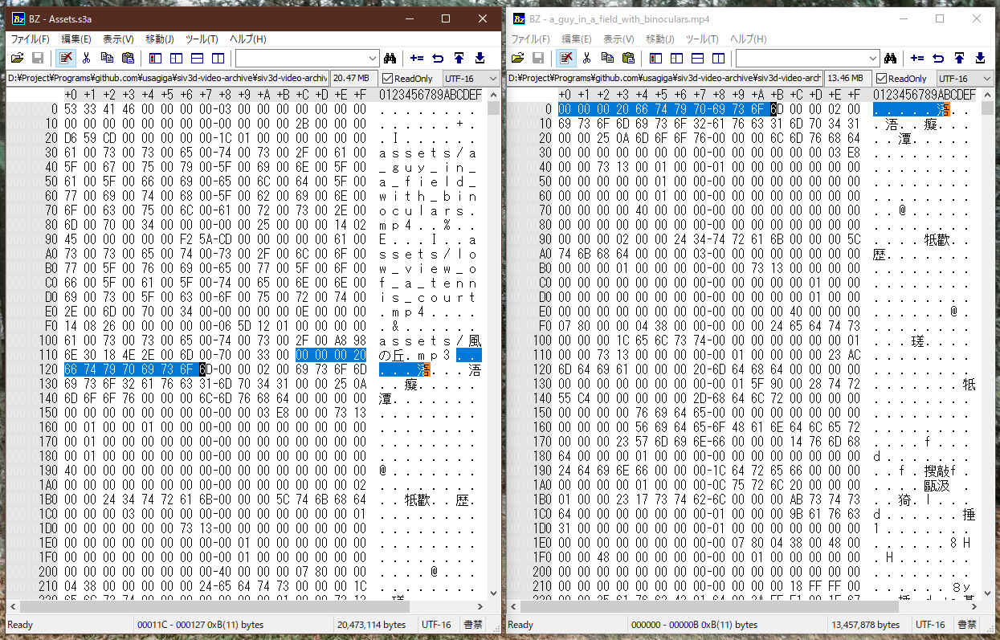

# 検証01 : Siv3D (siv6) のアーカイブファイルの仕様

Siv3D (siv6) のアーカイブファイル( `*.s3a` 、以下アーカイブファイル)はどのような実装がなされているのかを確認する。

## TL;DR

- アーカイブ対象のファイルのメタデータが先頭に入っている
- 続けて、アーカイブ対象のファイルのバイナリがそのまま突っ込まれている
- まあよくわかんねーから `ArchivedFileReader` 経由で読んだ方がよさそう

## 実験

1. `Archive.Create()` を利用して適当なディレクトリをアーカイブする
2. アーカイブファイルとアーカイブ対象のファイルをバイナリエディタを用いて表示する
3. バイナリ同士を比較して構造を確かめる

なお、手元で実行したい場合は `/siv3d-video-archive/Main.cpp` ( [リンク](https://github.com/usagiga/siv3d-video-archive/blob/main/siv3d-video-archive/Main.cpp) ) を実行されたい。

## 実験結果

Siv3Dのアーカイブファイルをバイナリエディタで見たときのスクリーンショットがこれ。結果を観察して、以下のデータが存在することがわかった。

- 先頭にはファイル名の配列と思しきもの
- 元ファイルのバイナリと全く同じバイナリ(図中反転部分参照)
- ファイル間は特に区切りのようなデータはない(ぶっつづけ)

## 考察

### データ構造

ここでは便宜上「先頭に見られるファイル名の配列と思しきもの」をヘッダ、「アーカイブ対象のファイル群とまったく同じバイナリの群」をボディと表記する。

実験から、ファイル内のデータ構造は以下のようになっていることが推測できる。

- ヘッダ
    - 何かの情報A
    - ファイル名1
    - 何かの情報B1
    - ファイル名2
    - 何かの情報B2
    - ...
    - 何かの情報n
    - 何かの情報Bn
- ボディ
    - ファイルのバイナリ1
    - ファイルのバイナリ2
    - ファイルのバイナリ3

ヘッダには **何かの情報** がいくつか入っているが、察するに以下のようなデータなのであろう。

- ヘッダにはアーカイブ対象のファイル名が格納されている
- ヘッダにはそれ以外の情報も格納されている
    - 具体的に何が入っているかは不明(読むのがめんどくさかった)
    - ボディに区切りがないので、区切り情報はヘッダ側に持ってそう
- 独自のヘッダが追加されているため、 **アーカイブファイルの名前(拡張子含む)を変えても元のファイルとしては扱えない**

また、ボディに関しては、察するに以下のようなデータなのであろう。

- 各ファイルのバイナリは、ヘッダに記述された順番で、そのまま格納されている
    - 別に圧縮とか区切りの挿入とかもなんもしてないっぽい

ふーん
